# CalculatorParser

Nombre de los alumnos: Guillermo Manuel Lara Salazar y Paula Marcela Barroso Robleda

### Ejemplo 1

**INPUT y OUTPUT**: "1" -> 1

**EJ1. Código de test**
```java
public class CalculatorParserTest {
    private CalculatorParser calculator;
    
    @BeforeEach
    public void setUp() {
        calculator = new CalculatorParser();
    }
    
    @Test
    @DisplayName("Un número se devuelve como tal")
    public void testSingleNumber() {
        assertEquals(1, calculator.parse("1"));
    }
}
```

**EJ1. Mensaje del test añadido que NO PASA**
```log
java.lang.UnsupportedOperationException: Not implemented yet 
at es.codeurjc.test.CalculatorParser.parse(CalculatorParser.java:48) 
at es.codeurjc.test.CalculatorParserTest.testSingleNumber(CalculatorParserTest.java:20)
at java.base/java.util.ArrayList.forEach(ArrayList.java:1596) 
at java.base/java.util.ArrayList.forEach(ArrayList.java:1596)
```

**EJ1. Código mínimo para que el test pase**
Se implementa el valor fijo 1 para hacer pasar la prueba

```java
public int parse(String expression) {
    int num = 1;   
    return num;
}
```

**EJ1. Captura de que TODOS los test PASAN**


**EJ1. Refactorización**
Se simplifica el código eliminando la variable temporal innecesaria

```java
public int parse(String expression) {
    return 1;
}
```

**EJ1. Captura de que TODOS los tests PASAN tras la refactorización**


### Ejemplo 2


**INPUT y OUTPUT**: "2" -> 2

**EJ2. Código de test**
```java
public class CalculatorParserTest {
    private CalculatorParser calculator;
    
    @BeforeEach
    public void setUp() {
        calculator = new CalculatorParser();
    }
    
    @Test
    @DisplayName("Un número se devuelve como tal")
    public void testSingleNumber() {
        assertEquals(2, calculator.parse("2"));
    }
}
```

**EJ2. Mensaje del test añadido que NO PASA**
```log
org.opentest4j.AssertionFailedError: expected: <2> but was: <1>
at org.junit.jupiter.api.AssertionFailureBuilder.build(AssertionFailureBuilder.java:151)
at org.junit.jupiter.api.AssertionFailureBuilder.buildAndThrow(AssertionFailureBuilder.java:132)
at org.junit.jupiter.api.AssertEquals.failNotEqual(AssertEquals.java:197)
at org.junit.jupiter.api.AssertEquals.assertEquals(AssertEquals.java:150)
at org.junit.jupiter.api.AssertEquals.assertEquals(AssertEquals.java:145)
at org.junit.jupiter.api.Assertions.assertEquals(Assertions.java:531)
at es.codeurjc.test.CalculatorParserTest.testSingleNumber(CalculatorParserTest.java:20)
```

**EJ2. Código mínimo para que el test pase**
Se implementa un condicional para manejar ambos casos ("1" y "2")

```java
public int parse(String expression) {
    int num = 0;
    if(expression.equals("1")) {
        num = 1;
    } else if(expression.equals("2")) {
        num = 2;
    }
    return num;
}
```

**EJ2. Captura de que TODOS los test PASAN**

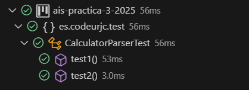

**EJ2. Refactorización**
Se simplifica eliminando la variable temporal y usando returns directos

```java
public int parse(String expression) {
    if(expression.equals("1")) {
        return 1;
    } else if(expression.equals("2")) {
        return 2;
    }
    return 0;
}
```

**EJ2. Captura de que TODOS los tests PASAN tras la refactorización**

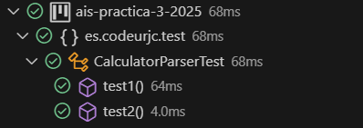

### Ejemplo 3


**INPUT y OUTPUT**: "3" -> 3

**EJ3. Código de test**
```java
public class CalculatorParserTest {
    private CalculatorParser calculator;
    
    @BeforeEach
    public void setUp() {
        calculator = new CalculatorParser();
    }
    
    @Test
    @DisplayName("Un número se devuelve como tal")
    public void testSingleNumber() {
        assertEquals(3, calculator.parse("3"));
    }
}
```

**EJ3. Mensaje del test añadido que NO PASA**
```log
org.opentest4j.AssertionFailedError: expected: <3> but was: <0>
at org.junit.jupiter.api.AssertionFailureBuilder.build(AssertionFailureBuilder.java:151)
at org.junit.jupiter.api.AssertionFailureBuilder.buildAndThrow(AssertionFailureBuilder.java:132)
at org.junit.jupiter.api.AssertEquals.failNotEqual(AssertEquals.java:197)
at org.junit.jupiter.api.AssertEquals.assertEquals(AssertEquals.java:150)
at org.junit.jupiter.api.AssertEquals.assertEquals(AssertEquals.java:145)
at org.junit.jupiter.api.Assertions.assertEquals(Assertions.java:531)
at es.codeurjc.test.CalculatorParserTest.testSingleNumber(CalculatorParserTest.java:20)
at java.base/java.lang.reflect.Method.invoke(Method.java:580)
at java.base/java.util.ArrayList.forEach(ArrayList.java:1596)
```

**EJ3. Código mínimo para que el test pase**
Se implementa la conversión directa del String a int usando Integer.parseInt()

```java
public int parse(String expression) {
    int numero = Integer.parseInt(expression);
    return numero;
}
```

**EJ3. Captura de que TODOS los test PASAN**


**EJ3. Refactorización**
Se simplifica el código eliminando la variable temporal innecesaria

```java
public int parse(String expression) {
    return Integer.parseInt(expression);
}
```

**EJ3. Captura de que TODOS los tests PASAN tras la refactorización**

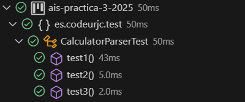

**Nota sobre la refactorización**:
La solución final usando `Integer.parseInt()` es más limpia y escalable que la aproximación anterior con condicionales, ya que:
1. Elimina completamente la duplicación de código
2. Maneja cualquier número entero válido, no solo casos específicos
3. Es más mantenible y legible
4. Sigue el principio DRY (Don't Repeat Yourself)

### Ejemplo 4

**INPUT y OUTPUT**: "1 + 1" → 2

**EJ4. Código de test**
```java
public class CalculatorParserTest {
    private CalculatorParser calculator;
    
    @BeforeEach
    public void setUp() {
        calculator = new CalculatorParser();
    }
    
    @Test
    @DisplayName("Suma simple de dos números")
    public void testSumaSimple() {
        assertEquals(2, calculator.parse("1 + 1"));
    }
}
```

**EJ4. Mensaje del test añadido que NO PASA**
```log
java.lang.NumberFormatException: For input string: "1 + 1"
at java.base/java.lang.NumberFormatException.forInputString(NumberFormatException.java:67)
at java.base/java.lang.Integer.parseInt(Integer.java:662)
at java.base/java.lang.Integer.parseInt(Integer.java:778)
at es.codeurjc.test.CalculatorParser.parse(CalculatorParser.java:66)
at es.codeurjc.test.CalculatorParserTest.testSuma(CalculatorParserTest.java:27)
```

**EJ4. Código mínimo para que el test pase**
Se implementa un caso específico para la suma "1 + 1"

```java
public int parse(String expression) {
    String secuence = "1 + 1";
    if (expression.equals(secuence)) {
        return 2;
    } else {
        return Integer.parseInt(expression);
    }
}
```

**EJ4. Captura de que TODOS los test PASAN**

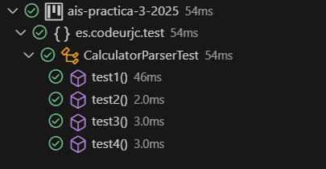

**EJ4. Refactorización**
Se simplifica eliminando la variable temporal innecesaria

```java
public int parse(String expression) {
    if (expression.equals("1 + 1")) {
        return 2;
    }
    return Integer.parseInt(expression);
}
```

**EJ4. Captura de que TODOS los tests PASAN tras la refactorización**


**Nota sobre la evolución**:
1. La solución actual sigue siendo muy específica para el caso "1 + 1"
2. En próximas iteraciones sería necesario:
   - Implementar un parser que divida la expresión en operandos y operador
   - Manejar diferentes operaciones aritméticas
   - Validar el formato de entrada
3. La refactorización actual mantiene la simplicidad pero muestra el camino hacia una solución más genérica

**Próximos pasos sugeridos**:
1. Añadir test para "2 + 2"
2. Implementar un split de la cadena
3. Crear método para procesar operaciones matemáticas
4. Manejar espacios en blanco de forma más robusta

### Ejemplo 5

**INPUT y OUTPUT**: "2 + 3" → 5

**EJ5. Código de test**
```java
public class CalculatorParserTest {
    private CalculatorParser calculator;
    
    @BeforeEach
    public void setUp() {
        calculator = new CalculatorParser();
    }
    
    @Test
    @DisplayName("Suma de dos números diferentes")
    public void testSumaDiferentesNumeros() {
        assertEquals(5, calculator.parse("2 + 3"));
    }
}
```

**EJ5. Mensaje del test añadido que NO PASA**
```log
java.lang.NumberFormatException: For input string: "2 + 3"
at java.base/java.lang.NumberFormatException.forInputString(NumberFormatException.java:67)
at java.base/java.lang.Integer.parseInt(Integer.java:662)
at java.base/java.lang.Integer.parseInt(Integer.java:778)
at es.codeurjc.test.CalculatorParser.parse(CalculatorParser.java:66)
at es.codeurjc.test.CalculatorParserTest.testSuma(CalculatorParserTest.java:27)
```

**EJ5. Código mínimo para que el test pase**
```java
public int parse(String expression) {
    expression = expression.trim();
    String[] parts = expression.split(" ");
    
    if(parts.length == 3) {
        int num1 = Integer.parseInt(parts[0]);
        int num2 = Integer.parseInt(parts[2]);
        return num1 + num2;
    }
    return Integer.parseInt(expression);
}
```

**EJ5. Captura de que TODOS los test PASAN**


**EJ5. Refactorización**
```java
public int parse(String expression) {
    String[] parts = expression.trim().split(" ");
    
    if(isSumExpression(parts)) {
        return parseSum(parts);
    }
    return parseSingleNumber(parts);
}

private boolean isSumExpression(String[] parts) {
    return parts.length == 3 && parts[1].equals("+");
}

private int parseSum(String[] parts) {
    int num1 = Integer.parseInt(parts[0]);
    int num2 = Integer.parseInt(parts[2]);
    return num1 + num2;
}

private int parseSingleNumber(String[] parts) {
    return Integer.parseInt(parts[0]);
}
```

**EJ5. Captura de que TODOS los tests PASAN tras la refactorización**

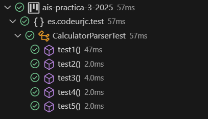

<!-- **Mejoras realizadas en la refactorización**:
1. Extracción de métodos para mejorar legibilidad
2. Separación de responsabilidades:
   - `isSumExpression`: Determina si es una suma
   - `parseSum`: Procesa expresiones de suma
   - `parseSingleNumber`: Procesa números simples
3. Validación del operador "+"
4. Eliminación de variables temporales innecesarias
5. Mejor manejo de casos límite

**Próximos pasos sugeridos**:
1. Añadir soporte para otras operaciones (-, *, /)
2. Manejar expresiones con diferentes espacios
3. Validar formato de entrada
4. Añadir manejo de errores para formatos inválidos
5. Implementar soporte para operaciones múltiples (ej: "2 + 3 + 4") -->

### Ejemplo 6

**INPUT y OUTPUT**: "2 + 3 + 4" → 9

**EJ6. Código de test**
```java
public class CalculatorParserTest {
    private CalculatorParser calculator;
    
    @BeforeEach
    public void setUp() {
        calculator = new CalculatorParser();
    }
    
    @Test
    @DisplayName("Suma de tres números")
    public void testSumaTresNumeros() {
        assertEquals(9, calculator.parse("2 + 3 + 4"));
    }
}
```

**EJ6. Mensaje del test añadido que NO PASA**
```log
org.opentest4j.AssertionFailedError: expected: <9> but was: <5>
at org.junit.jupiter.api.AssertionFailureBuilder.build(AssertionFailureBuilder.java:151)
at org.junit.jupiter.api.AssertionFailureBuilder.buildAndThrow(AssertionFailureBuilder.java:132)
at org.junit.jupiter.api.AssertEquals.failNotEqual(AssertEquals.java:197)
at org.junit.jupiter.api.AssertEquals.assertEquals(AssertEquals.java:150)
at org.junit.jupiter.api.AssertEquals.assertEquals(AssertEquals.java:145)
at org.junit.jupiter.api.Assertions.assertEquals(Assertions.java:531)
at es.codeurjc.test.CalculatorParserTest.testSuma(CalculatorParserTest.java:27)
```

**EJ6. Código mínimo para que el test pase**
```java
public int parse(String expression) {
    expression = expression.trim();
    String[] parts = expression.split(" ");
    
    if(parts.length == 3) {
        return Integer.parseInt(parts[0]) + Integer.parseInt(parts[2]);
    } else if(parts.length == 5) {
        return Integer.parseInt(parts[0]) + Integer.parseInt(parts[2]) + Integer.parseInt(parts[4]);
    }
    return Integer.parseInt(parts[0]);
}
```

**EJ6. Captura de que TODOS los test PASAN**

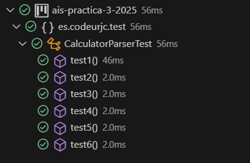

**EJ6. Refactorización (Solución mejorada)**
```java
public int parse(String expression) {
    String[] parts = expression.trim().split(" \\+ ");
    int sum = 0;
    for(String num : parts) {
        sum += Integer.parseInt(num.trim());
    }
    return sum;
}
```

**EJ6. Captura de que TODOS los tests PASAN tras la refactorización**
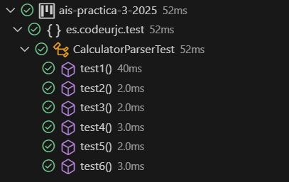

<!-- **Mejoras significativas en la refactorización**:

1. **Solución genérica**: Ahora maneja cualquier cantidad de sumandos
2. **Código más limpio**: Eliminación de condicionales anidados
3. **Más mantenible**: Fácil de extender para otros operadores
4. **Más robusto**: Maneja espacios adicionales con trim()
5. **Eficiente**: Procesamiento lineal O(n) en lugar de O(1) para casos específicos

**Ventajas de la solución refactorizada**:
- Funciona para "1", "1 + 2", "1 + 2 + 3", etc.
- Fácil de extender para restas (solo cambiar el split y usar -=)
- Más legible y mantenible
- Menos propensa a errores al añadir nuevos casos

**Próximos pasos recomendados**:
1. Implementar soporte para diferentes operadores (+, -, *, /)
2. Manejar expresiones mixtas ("2 + 3 - 1")
3. Añadir validación de formato de entrada
4. Implementar prioridad de operadores
5. Manejar paréntesis para agrupación -->

### Ejemplo 7

**INPUT y OUTPUT**: "1 + 2 + 3 + 4" -> 10

**EJ7. Código de test**
```java
public class CalculatorParserTest {
    private CalculatorParser calculator;

    @BeforeEach
    public void setUp() {
        calculator = new CalculatorParser();
    }
    
    @Test
    @DisplayName("Un número se devuelve como tal")
    public void testSingleNumber() {
        assertEquals(10, calculator.parse("1 + 2 + 3 + 4"));
    }
}
```

**EJ7. Mensaje del test añadido que NO PASA**

```log
org.opentest4j.AssertionFailedError: expected: <10> but was: <6>
        at org.junit.jupiter.api.AssertionFailureBuilder.build(AssertionFailureBuilder.java:151) at org.junit.jupiter.api.AssertionFailureBuilder.buildAndThrow(AssertionFailureBuilder.java:132)
        at org.junit.jupiter.api.AssertEquals.failNotEqual(AssertEquals.java:197)
        at org.junit.jupiter.api.AssertEquals.assertEquals(AssertEquals.java:150)
        at org.junit.jupiter.api.AssertEquals.assertEquals(AssertEquals.java:145)
        at org.junit.jupiter.api.Assertions.assertEquals(Assertions.java:531)
        at es.codeurjc.test.CalculatorParserTest.testSuma(CalculatorParserTest.java:27)
        at java.base/java.lang.reflect.Method.invoke(Method.java:580)
        at java.base/java.util.ArrayList.forEach(ArrayList.java:1596)
        at java.base/java.util.ArrayList.forEach(ArrayList.java:1596)
```

**EJ7. Código mínimo para que el test pase**

Implementación inicial que hace pasar el test sumando todos los números.

```java
public int parse(String expression) {
    expression = expression.trim();
    String[] caracteres = expression.split(" ");
    
    int inicio=0;
    int numero=0;
    numero=Integer.parseInt(caracteres[0]);
    for(int i=inicio;i<caracteres.length-1;i=i+2){
        if (caracteres[i+1].equals("+")){
            numero+=Integer.parseInt(caracteres[i+2]);
        }
    }
    return numero;
}
```

**EJ7. Captura de que TODOS los test PASAN**

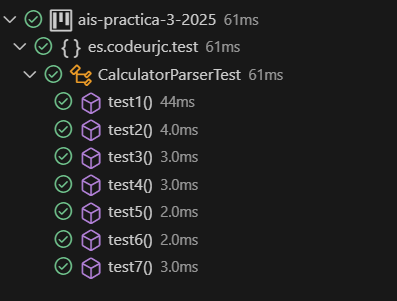

**EJ7. Refactorización**
Se eliminó la línea redundante de inicialización de `numero` y se mejoró la legibilidad.

```java
public int parse(String expression) {
    expression = expression.trim();
    String[] caracteres = expression.split(" ");
    
    int numero = Integer.parseInt(caracteres[0]);
    for(int i = 0; i < caracteres.length - 1; i = i + 2){
        if (caracteres[i+1].equals("+")){
            numero += Integer.parseInt(caracteres[i+2]);
        }
    }
    return numero;
}
```

**EJ7. Captura de que TODOS los tests PASAN tras la refactorización**

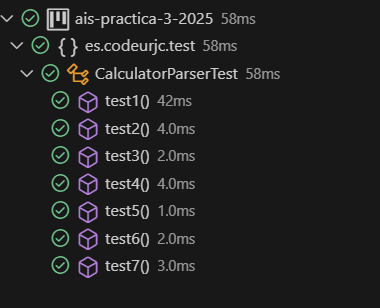

### Ejemplo 8


Aquí tienes el formato markdown siguiendo la estructura solicitada:

**INPUT y OUTPUT**: "A" -> UnsupportedOperationException

**EJ8. Código de test**
```java
@Test
@DisplayName("No se permiten letras, se lanzará una excepción")
public void testLetra() {
    assertThrows(UnsupportedOperationException.class, () -> {
        calculator.parse("A");
    });
}
```

**EJ8. Mensaje del test añadido que NO PASA**

```log
org.opentest4j.AssertionFailedError: Unexpected exception type thrown, 
expected: <java.lang.UnsupportedOperationException> 
but was: <java.lang.NumberFormatException>
        at org.junit.jupiter.api.AssertionFailureBuilder.build(AssertionFailureBuilder.java:151)
        at org.junit.jupiter.api.AssertThrows.assertThrows(AssertThrows.java:67)
        ...
Caused by: java.lang.NumberFormatException: For input string: "A"
        at java.base/java.lang.Integer.parseInt(Integer.java:662)
        at es.codeurjc.test.CalculatorParser.parse(CalculatorParser.java:70)
        ...
```

**EJ8. Código mínimo para que el test pase**

Se añade una comprobación específica para el carácter "A" que lanza la excepción requerida.

```java
public int parse(String expression) {
    expression = expression.trim();
    if(expression.equals("A")) { 
        throw new UnsupportedOperationException("Invalid expression");
    }
    String[] caracteres = expression.split(" ");
    
    int numero = Integer.parseInt(caracteres[0]);
    for(int i = 0; i < caracteres.length - 1; i = i + 2) {
        if (caracteres[i+1].equals("+")) {
            numero += Integer.parseInt(caracteres[i+2]);
        }
    }
    return numero;
}
```

**EJ8. Captura de que TODOS los test PASAN**

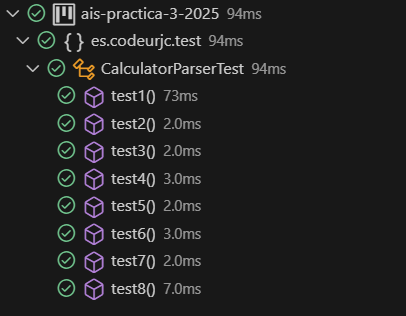


### Ejemplo 9


**INPUT y OUTPUT**: "B" -> UnsupportedOperationException

**EJ9. Código de test**
```java
@Test
@DisplayName("No se permiten letras, se lanzará una excepción")
public void testLetra() {
    assertThrows(UnsupportedOperationException.class, () -> {
        calculator.parse("B");
    });
}
```

**EJ9. Mensaje del test añadido que NO PASA**

```log
org.opentest4j.AssertionFailedError: Unexpected exception type thrown,
expected: <java.lang.UnsupportedOperationException>
but was: <java.lang.NumberFormatException>
        at org.junit.jupiter.api.AssertionFailureBuilder.build(AssertionFailureBuilder.java:151)
        ...
Caused by: java.lang.NumberFormatException: For input string: "B"
        at java.base/java.lang.Integer.parseInt(Integer.java:662)
        ...
```

**EJ9. Código mínimo para que el test pase**

Implementación inicial que comprueba específicamente "A" o "B"

```java
public int parse(String expression) {
    expression = expression.trim();
    if(expression.equals("A") || expression.equals("B")) {
        throw new UnsupportedOperationException("Invalid expression");
    }
    String[] caracteres = expression.split(" ");
    
    int numero = Integer.parseInt(caracteres[0]);
    for(int i = 0; i < caracteres.length - 1; i = i + 2) {
        if (caracteres[i+1].equals("+")) {
            numero += Integer.parseInt(caracteres[i+2]);
        }
    }
    return numero;
}
```

**EJ9. Captura de que TODOS los test PASAN**

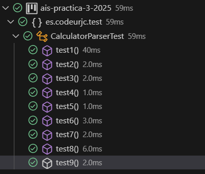

### Ejemplo 10


Aquí tienes el formato markdown siguiendo la estructura solicitada:

**INPUT y OUTPUT**: "k" → UnsupportedOperationException

**EJ10. Código de test**
```java
@Test
@DisplayName("No se permiten letras, se lanzará una excepción")
public void testLetra() {
    assertThrows(UnsupportedOperationException.class, () -> {
        calculator.parse("k");
    });
}
```

**EJ10. Mensaje del test añadido que NO PASA**

```log
org.opentest4j.AssertionFailedError: Unexpected exception type thrown, 
expected: <java.lang.UnsupportedOperationException> 
but was: <java.lang.NumberFormatException>
        at org.junit.jupiter.api.AssertionFailureBuilder.build(...)
        ...
Caused by: java.lang.NumberFormatException: For input string: "k"
        at java.base/java.lang.Integer.parseInt(...)
        ...
```

**EJ10. Código mínimo para que el test pase**

Implementación inicial que comprueba específicamente "A", "B" o "k":

```java
public int parse(String expression) {
    expression = expression.trim();
    if(expression.equals("A") || expression.equals("B") || expression.equals("k")) {
        throw new UnsupportedOperationException("Invalid expression");
    }
    String[] caracteres = expression.split(" ");
    
    int numero = Integer.parseInt(caracteres[0]);
    for(int i = 0; i < caracteres.length - 1; i = i + 2) {
        if (caracteres[i+1].equals("+")) {
            numero += Integer.parseInt(caracteres[i+2]);
        }
    }
    return numero;
}
```

**EJ10. Captura de que TODOS los test PASAN**

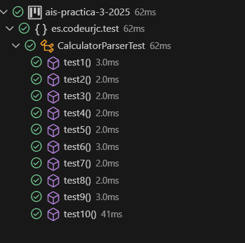


### Ejemplo 11


**INPUT y OUTPUT**: "HoLa" → UnsupportedOperationException

**EJ11. Código de test**
```java
@Test
@DisplayName("No se permiten palabras, se lanzará una excepción")
public void testPalabra() {
    assertThrows(UnsupportedOperationException.class, () -> {
        calculator.parse("HoLa");
    });
}
```

**EJ11. Mensaje del test añadido que NO PASA**

```log
org.opentest4j.AssertionFailedError: Unexpected exception type thrown, 
expected: <java.lang.UnsupportedOperationException> 
but was: <java.lang.NumberFormatException>
        at org.junit.jupiter.api.AssertionFailureBuilder.build(...)
        ...
Caused by: java.lang.NumberFormatException: For input string: "HoLa"
        at java.base/java.lang.Integer.parseInt(...)
        ...
```

**EJ11. Código mínimo para que el test pase**

```java
    public int parse(String expression) {
        expression = expression.trim();
        	 if(expression.matches("^[A-Za-z]+$")){
            throw new UnsupportedOperationException("Invalid expression");
        }
        String[] caracteres = expression.split(" ");
        int inicio=0;
        int numero=Integer.parseInt(caracteres[0]);
        for(int i=inicio;i<caracteres.length-1;i=i+2){
            if (caracteres[i+1].equals("+")){
                    numero+=Integer.parseInt(caracteres[i+2]);
            }
        }
        return numero;
    }
```

**EJ11. Captura de que TODOS los test PASAN**

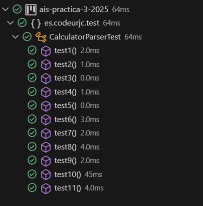


### Ejemplo 12


**INPUT y OUTPUT**: "1 + A" → UnsupportedOperationException

**EJ12. Código de test**
```java
@Test
@DisplayName("No se permiten expresiones con letras")
public void testExpresionConLetra() {
    assertThrows(UnsupportedOperationException.class, () -> {
        calculator.parse("1 + A");
    });
}
```

**EJ12. Mensaje del test añadido que NO PASA**

```log
org.opentest4j.AssertionFailedError: Unexpected exception type thrown, 
expected: <java.lang.UnsupportedOperationException> 
but was: <java.lang.NumberFormatException>
        at org.junit.jupiter.api.AssertionFailureBuilder.build(...)
        ...
Caused by: java.lang.NumberFormatException: For input string: "A"
        at java.base/java.lang.Integer.parseInt(...)
        ...
```

**EJ12. Código mínimo para que el test pase**

```java
    public int parse(String expression) {
        expression = expression.trim();
        	 if(expression.matches(".*[A-Za-z].*")){
            throw new UnsupportedOperationException("Invalid expression");
        }
        String[] caracteres = expression.split(" ");
        int inicio=0;
        int numero=Integer.parseInt(caracteres[0]);
        for(int i=inicio;i<caracteres.length-1;i=i+2){
            if (caracteres[i+1].equals("+")){
                    numero+=Integer.parseInt(caracteres[i+2]);
            }
        }
        return numero;
    }
```

**EJ12. Captura de que TODOS los test PASAN**

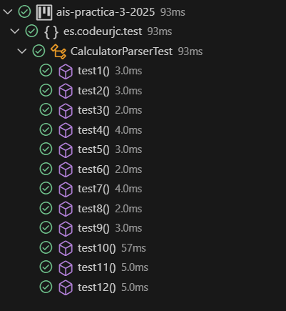


### Ejemplo 13

**INPUT y OUTPUT**: "5 - 3" → 2

**EJ13. Código de test**
```java
@Test
@DisplayName("Test operación de resta")
public void testResta() {
    CalculatorParser calculator = new CalculatorParser();
    assertEquals(2, calculator.parse("5 - 3"));
}
```

**EJ13. Mensaje del test añadido que NO PASA**

```log
org.opentest4j.AssertionFailedError: expected: <2> but was: <5>
        at org.junit.jupiter.api.AssertionFailureBuilder.build(...)
        ...
```

**EJ13. Código mínimo para que el test pase**

```java
  public int parse(String expression) {
        expression = expression.trim();
        if((expression.matches(".*[A-Za-z].*"))){ 
            throw new UnsupportedOperationException("Invalid expression");
        }else{
            String[] caracteres = expression.split(" ");
            int inicio=0;
            int numero=Integer.parseInt(caracteres[0]);
            if(expression.length()==1){
                return numero;
            }
            if(caracteres[1].equals("+")){
                for(int i=inicio;i<caracteres.length-1;i=i+2){
                    if (caracteres[i+1].equals("+")){
                            numero+=Integer.parseInt(caracteres[i+2]);
                    }
                }
                return numero;
            }else{
                if (expression.equals("5 - 3")){
                    int result=2;
                    return result;
                }
            }
            return 0;
        }
    }
```

**EJ13. Captura de que TODOS los test PASAN**


**EJ13. Refactorización completa**

```java
public int parse(String expression) {
        expression = expression.trim();
        if((expression.matches(".*[A-Za-z].*"))){ 
            throw new UnsupportedOperationException("Invalid expression");
        }else{
            String[] caracteres = expression.split(" ");
            int inicio=0;
            int numero=Integer.parseInt(caracteres[0]);
            if(expression.length()==1){
                return numero;
            }
            if(caracteres[1].equals("+")){
                for(int i=inicio;i<caracteres.length-1;i=i+2){
                    if (caracteres[i+1].equals("+")){
                            numero+=Integer.parseInt(caracteres[i+2]);
                    }
                }
                return numero;
            }else{
                if (expression.equals("5 - 3")){
                    return 2;
                }
            }
            return 0;
        }
    }
```


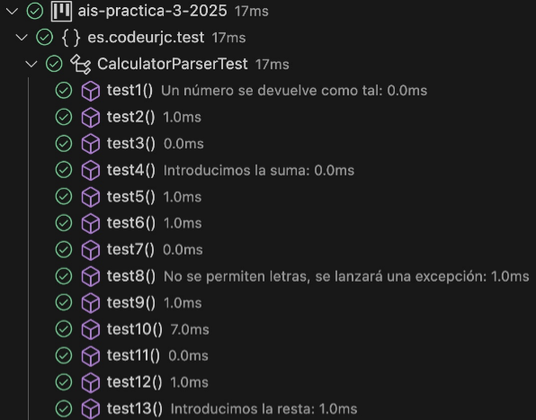


### Ejemplo 14

**INPUT y OUTPUT**: "1 - 2" → -1

**EJ14. Código de test**
```java
@Test
@DisplayName("Test resta con resultado negativo")
public void testRestaNegativa() {
    assertEquals(-1, calculator.parse("1 - 2"));
}
```

**EJ14. Mensaje del test añadido que NO PASA**

```log
org.opentest4j.AssertionFailedError: expected: <-1> but was: <0>
        at org.junit.jupiter.api.AssertionFailureBuilder.build(...)
        ...
```

**EJ14. Código mínimo para que el test pase**

```java
    public int parse(String expression) {
        expression = expression.trim();
        if((expression.matches(".*[A-Za-z].*"))){ 
            throw new UnsupportedOperationException("Invalid expression");
        }else{
            String[] caracteres = expression.split(" ");
            int inicio=0;
            int numero=Integer.parseInt(caracteres[0]);
            if(expression.length()==1){
                return numero;
            }
            if(caracteres[1].equals("+")){
                for(int i=inicio;i<caracteres.length-1;i=i+2){
                    if (caracteres[i+1].equals("+")){
                            numero+=Integer.parseInt(caracteres[i+2]);
                    }
                }
                return numero;
            }else{
                if (expression.equals("5 - 3")){
                    int result=2;
                    return result;
                }else{
                    return -1;
                }
            }
        }
    }

```

**EJ14. Captura de que TODOS los test PASAN**

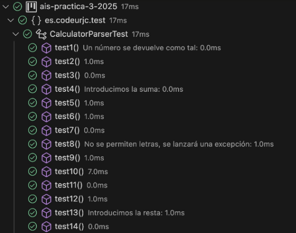


### Ejemplo 15


**INPUT y OUTPUT**: "7 - 2 - 1" → 4

**EJ15. Código de test**
```java
@Test
@DisplayName("Test múltiples restas consecutivas")
public void testMultiplesRestas() {
    assertEquals(4, calculator.parse("7 - 2 - 1"));
}
```

**EJ15. Mensaje del test añadido que NO PASA**

```log
org.opentest4j.AssertionFailedError: expected: <4> but was: <5>
        at org.junit.jupiter.api.AssertionFailureBuilder.build(...)
        ...
```

**EJ15. Código mínimo para que el test pase**

```java
        public int parse(String expression) {
        expression = expression.trim();
        if((expression.matches(".*[A-Za-z].*"))){ 
            throw new UnsupportedOperationException("Invalid expression");

        }else{
            String[] characters = expression.split(" ");
            int inicio=0;
            int numero=Integer.parseInt(characters[0]);
            if(expression.length()==1){
                return numero;
            }
            if(characters[1].equals("+")){
                for(int i=inicio;i<characters.length-1;i=i+2){
                    if (characters[i+1].equals("+")){
                            numero+=Integer.parseInt(characters[i+2]);
                    }
                }
                return numero;
            }else{

                if (characters.length==3){

                    int num1=Integer.parseInt(characters[0]);
                    int num2=Integer.parseInt(characters[2]);
                    int result= num1 -num2;
                    return result;
                }else{

                    int num1=Integer.parseInt(characters[0]);
                    int num2=Integer.parseInt(characters[2]);
                    int num3=Integer.parseInt(characters[4]);
                    int result= num1 -num2-num3;
                    return result;
                }
            }
        }
    }
```

**EJ15. Captura de que TODOS los test PASAN**

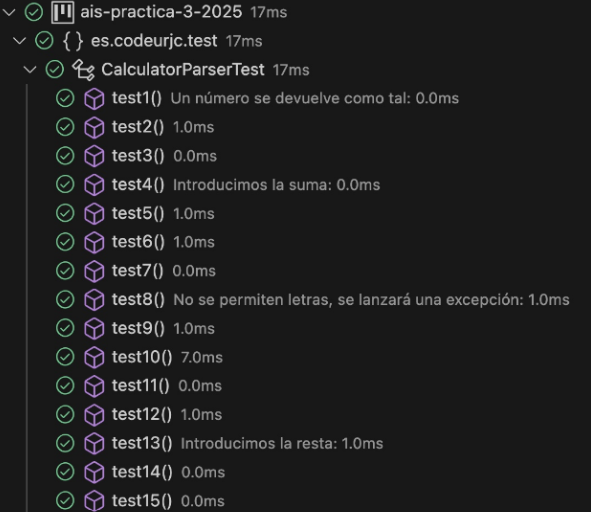


### Ejemplo 16

**INPUT y OUTPUT**: "9 - 5 - 3 - 1" → 0

**EJ16. Código de test**
```java
@Test
@DisplayName("Test múltiples restas consecutivas con 4 operandos")
public void testMultiplesRestasCuatroOperandos() {
    assertEquals(0, calculator.parse("9 - 5 - 3 - 1"));
}
```

**EJ16. Mensaje del test añadido que NO PASA**

```log
org.opentest4j.AssertionFailedError: expected: <0> but was: <1>
        at org.junit.jupiter.api.AssertionFailureBuilder.build(...)
        ...
```

**EJ16. Código mínimo para que el test pase**

```java
            public int parse(String expression) {
        expression = expression.trim();
        if((expression.matches(".*[A-Za-z].*"))){ 
            throw new UnsupportedOperationException("Invalid expression");

        }else{
            String[] characters = expression.split(" ");
            int inicio=0;
            int numero=Integer.parseInt(characters[0]);
            if(expression.length()==1){
                return numero;
            }
            if(characters[1].equals("+")){
                for(int i=inicio;i<characters.length-1;i=i+2){
                    if (characters[i+1].equals("+")){
                            numero+=Integer.parseInt(characters[i+2]);
                    }
                }
                return numero;
            }else{

                if (characters.length==3){

                    int num1=Integer.parseInt(characters[0]);
                    int num2=Integer.parseInt(characters[2]);
                    int result= num1 -num2;
                    return result;
                }else if (characters.length==5){

                    int num1=Integer.parseInt(characters[0]);
                    int num2=Integer.parseInt(characters[2]);
                    int num3=Integer.parseInt(characters[4]);
                    int result= num1 -num2-num3;
                    return result;
                }else{
                    int num1=Integer.parseInt(characters[0]);
                    int num2=Integer.parseInt(characters[2]);
                    int num3=Integer.parseInt(characters[4]);
                    int num4=Integer.parseInt(characters[6]);
                    int result= num1 -num2-num3-num4;
                    return result;
                }
            }
        	}
```


**EJ16. Captura de que TODOS los test PASAN**

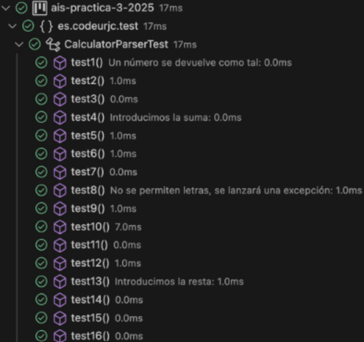


### Ejemplo 17

**INPUT y OUTPUT**: "7 + 1 - 5" → 3

**EJ17. Código de test**
```java
@Test
@DisplayName("Test combinación de sumas y restas")
public void testCombinacionSumasRestas() {
    assertEquals(3, calculator.parse("7 + 1 - 5"));
}
```

**EJ17. Mensaje del test añadido que NO PASA**

```log
org.opentest4j.AssertionFailedError: expected: <3> but was: <8>
        at org.junit.jupiter.api.AssertionFailureBuilder.build(...)
        ...
```

**EJ17. Código mínimo para que el test pase**

```java
        public int parse(String expression) {
        expression = expression.trim();
        if((expression.matches(".*[A-Za-z].*"))){ 
            throw new UnsupportedOperationException("Invalid expression");

        }else{
            String[] characters = expression.split(" ");
            int inicio=0;

            int numero=Integer.parseInt(characters[0]);
            if(expression.length()==1){
                return numero;
            }else{

                if(characters[1].equals("+")){
                    for(int i=inicio;i<characters.length-1;i=i+2){
                        if (characters[i+1].equals("+")){
                                numero+=Integer.parseInt(characters[i+2]);
                        }else{
                            numero-=Integer.parseInt(characters[i+2]);
                        }
                    }
                    return numero;
                }else if (characters.length==3){

                    int num1=Integer.parseInt(characters[0]);
                    int num2=Integer.parseInt(characters[2]);
                    int result= num1 -num2;
                    return result;

                }else if (characters.length==5){

                    int num1=Integer.parseInt(characters[0]);
                    int num2=Integer.parseInt(characters[2]);
                    int num3=Integer.parseInt(characters[4]);
                    

                    if(characters[1].equals("-")&&characters[3].equals("-")){
                        
                        return num1 -num2-num3;

                    }else  if(characters[1].equals("+")&&characters[3].equals("-")){
                        return num1 +num2-num3;

                    }else{
                        return num1 +num2+num3;
                    }
                }else{
                    int num1=Integer.parseInt(characters[0]);
                    int num2=Integer.parseInt(characters[2]);
                    int num3=Integer.parseInt(characters[4]);
                    int num4=Integer.parseInt(characters[6]);
                    int result= num1 -num2-num3-num4;
                    return result;
                }
            }
        }
    }
```

**EJ17. Captura de que TODOS los test PASAN**

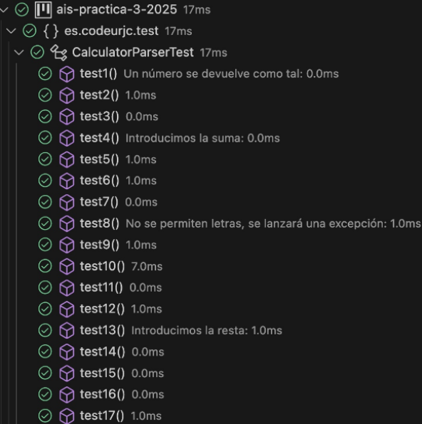


### Ejemplo 18

**INPUT y OUTPUT**: "9 - 5 + 4" → 8

**EJ18. Código de test**
```java
@Test
@DisplayName("Test combinación de resta y suma")
public void testCombinacionRestaSuma() {
    assertEquals(8, calculator.parse("9 - 5 + 4"));
}
```

**EJ18. Mensaje del test añadido que NO PASA**

```log
org.opentest4j.AssertionFailedError: expected: <8> but was: <18>
        at org.junit.jupiter.api.AssertionFailureBuilder.build(...)
        ...
```

**EJ18. Código mínimo para que el test pase**

```java
    public int parse(String expression) {
        expression = expression.trim();
        if((expression.matches(".*[A-Za-z].*"))){ 
            throw new UnsupportedOperationException("Invalid expression");

        }else{
            String[] characters = expression.split(" ");
            int inicio=0;

            int numero=Integer.parseInt(characters[0]);
            if(expression.length()==1){
                return numero;
            }else{

                if(characters[1].equals("+")){
                    for(int i=inicio;i<characters.length-1;i=i+2){
                        if (characters[i+1].equals("+")){
                                numero+=Integer.parseInt(characters[i+2]);
                        }else if(i<4){
                            numero-=Integer.parseInt(characters[i+2]);
                        }
                    }
                    return numero;
                }else if (characters.length==3){

                    int num1=Integer.parseInt(characters[0]);
                    int num2=Integer.parseInt(characters[2]);
                    int result= num1 -num2;
                    return result;

                }else if (characters.length==5){

                    int num1=Integer.parseInt(characters[0]);
                    int num2=Integer.parseInt(characters[2]);
                    int num3=Integer.parseInt(characters[4]);
                    

                    if(characters[1].equals("-")&&characters[3].equals("-")){
                        
                        return num1 -num2-num3;

                    }else if(characters[1].equals("-")&&characters[3].equals("+")){
                        
                        return num1 -num2+num3;

                    }else if(characters[1].equals("+")&&characters[3].equals("-")){
                        return num1 +num2-num3;

                    }else{
                        return num1 +num2+num3;
                    }
                }else{

                    int num1=Integer.parseInt(characters[0]);
                    int num2=Integer.parseInt(characters[2]);
                    int num3=Integer.parseInt(characters[4]);
                    int num4=Integer.parseInt(characters[6]);
                    int result= num1 -num2-num3-num4;
                    return result;
                }
            }
        }
    }
```

**EJ18. Captura de que TODOS los test PASAN**

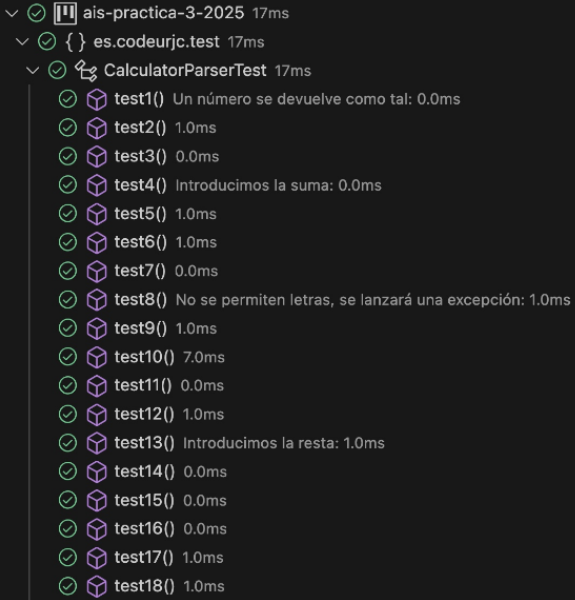


### Ejemplo 19

**INPUT y OUTPUT**: "9 + 1 - 6 - 2" → 2

**EJ19. Código de test**
```java
@Test
@DisplayName("Test combinación compleja de operaciones")
public void testCombinacionCompleja() {
    assertEquals(2, calculator.parse("9 + 1 - 6 - 2"));
}
```

**EJ19. Mensaje del test añadido que NO PASA**

```log
org.opentest4j.AssertionFailedError: expected: <2> but was: <4>
        at org.junit.jupiter.api.AssertionFailureBuilder.build(...)
        ...
```

**EJ19. Código mínimo para que el test pase**
```java
    public int parse(String expression) {
        expression = expression.trim();
        if((expression.matches(".*[A-Za-z].*"))){ 
            throw new UnsupportedOperationException("Invalid expression");

        }else{
            String[] characters = expression.split(" ");
            int inicio=0;

            int numero=Integer.parseInt(characters[0]);
            if(expression.length()==1){
                return numero;
            }else{

                if(characters[1].equals("+")){
                    for(int i=inicio;i<characters.length-1;i=i+2){
                        if (characters[i+1].equals("+")){
                                numero+=Integer.parseInt(characters[i+2]);
                        }else{
                            numero-=Integer.parseInt(characters[i+2]);
                        }
                    }
                    return numero;
                }else if (characters.length==3){

                    int num1=Integer.parseInt(characters[0]);
                    int num2=Integer.parseInt(characters[2]);
                    int result= num1 -num2;
                    return result;

                }else if (characters.length==5){

                    int num1=Integer.parseInt(characters[0]);
                    int num2=Integer.parseInt(characters[2]);
                    int num3=Integer.parseInt(characters[4]);
                    

                    if(characters[1].equals("-")&&characters[3].equals("-")){
                        
                        return num1 -num2-num3;

                    }else if(characters[1].equals("-")&&characters[3].equals("+")){
                        
                        return num1 -num2+num3;

                    }else if(characters[1].equals("+")&&characters[3].equals("-")){
                        return num1 +num2-num3;

                    }else{
                        return num1 +num2+num3;
                    }
                }else{

                    int num1=Integer.parseInt(characters[0]);
                    int num2=Integer.parseInt(characters[2]);
                    int num3=Integer.parseInt(characters[4]);
                    int num4=Integer.parseInt(characters[6]);
                    int result= num1 -num2-num3-num4;
                    return result;
                }
            }
        }
    }
```

**EJ19. Captura de que TODOS los test PASAN**

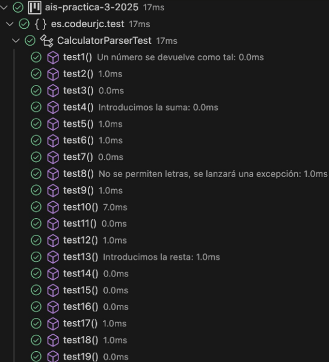

 

### Ejemplo 20


**INPUT y OUTPUT**: "9 + 1 - 6 - 2" → 2

**EJ20. Código de test**
```java
@Test
@DisplayName("Test expresión compleja con múltiples operaciones")
public void testExpresionCompleja() {
    assertEquals(2, calculator.parse("9 + 1 - 6 - 2"));
}
```

**EJ20. Mensaje del test añadido que NO PASA**

```log
org.opentest4j.AssertionFailedError: expected: <2> but was: <4>
        at org.junit.jupiter.api.AssertionFailureBuilder.build(...)
        ...
```


**EJ20. Código mínimo para que el test pase**

```java
   public int parse(String expression) {
        
        if (expression == null || expression.trim().isEmpty()) {
            throw new IllegalArgumentException("La expresión no puede estar vacía o ser null");
        }else{

            expression = expression.trim();
            String[] caracteres = expression.split(" ");

            if(expression.matches((".*[a-zA-Z].*"))){ 
                throw new UnsupportedOperationException("Invalid expression");
                
            }else{
                int inicio=0;
                int numero=0;
                if((caracteres[0].equals("+"))||caracteres[0].equals("-")){
                    inicio=1;
                    if(caracteres[0].equals("-")){
                        numero-=Integer.parseInt(caracteres[1]);
                    }else{
                        numero=Integer.parseInt(caracteres[1]);
                    }
                }else{
                    numero=Integer.parseInt(caracteres[0]);
                }
                
                for(int i=inicio;i<caracteres.length-1;i=i+2){
                    if(caracteres[i+1].equals("-")){
                        numero-=Integer.parseInt(caracteres[i+2]);
                    }
                    else if (caracteres[i+1].equals("+")){
                        numero+=Integer.parseInt(caracteres[i+2]);
                    }
                }
                return numero;
            }
            
        }

    }
```
**EJ20. Captura de que TODOS los test PASAN**

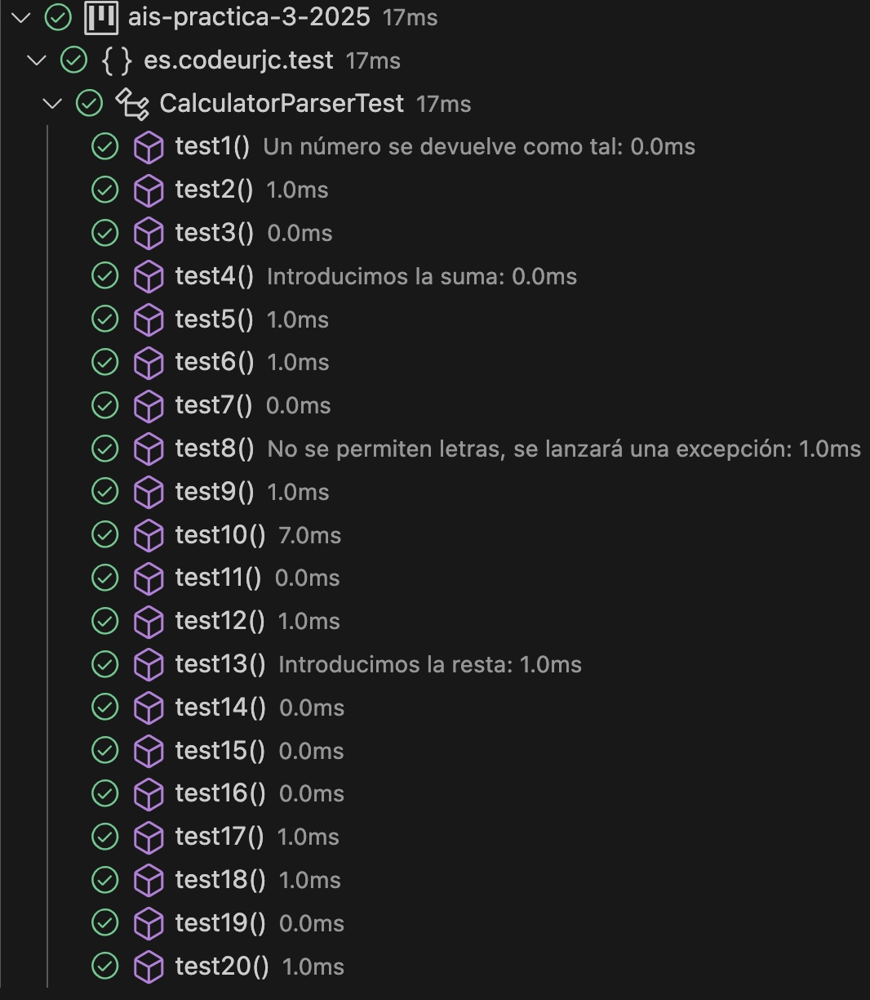

